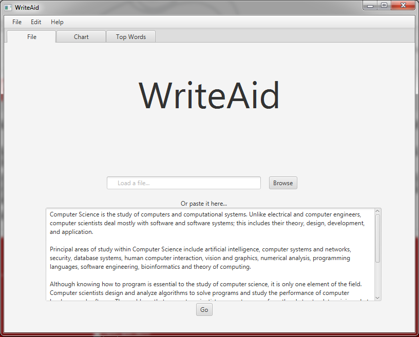
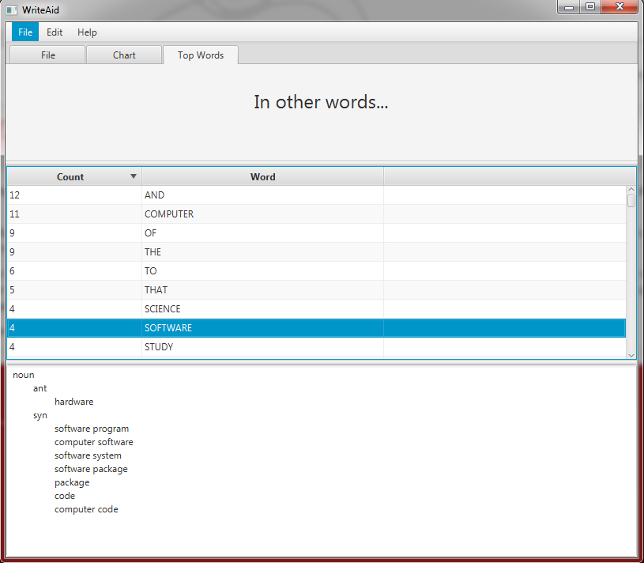

## Write Aid

A personal project by Garret Sweetwood (A work in progress)

This app was developed to help writers or students with two main functions.  First, after the user copies in the text of their article, WriteAid will count every iteration of every word.  This serves to point out words that are potentially used too much by displaying an ordered list.  Second, selecting a word from the list will automatically return a thesaurus search of that word divided into word forms.

